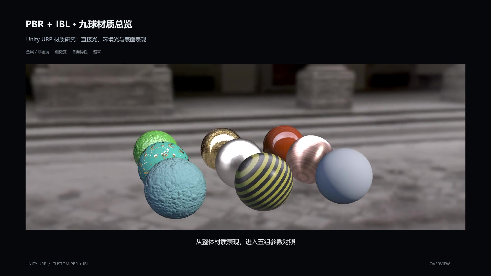
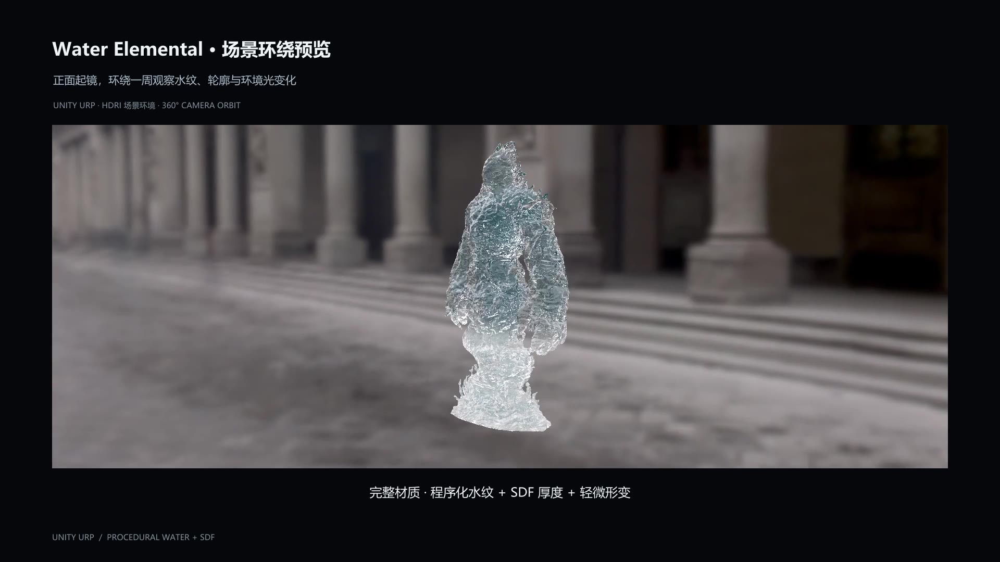

# TA Showreel · Technical Art Portfolio

A growing collection of my real-time rendering and technical art work, exploring materials, lighting, and procedural effects.

## [▶ View Portfolio](https://karma-gi.github.io/TA-Showreel/)

## PBR / IBL Shading & Parameterized Materials

A nine-sphere material study exploring how roughness, surface detail, and anisotropy shape the appearance of metals, dielectrics, and mixed materials.

- Cook–Torrance shading, BRDF LUT baking, and Split-Sum specular IBL using Unity's prefiltered reflection probes.
- Anisotropic highlights, approximate anisotropic environment reflections, triplanar bump mapping, and mask-driven material blending.

[▶ PBR / IBL Showcase](https://karma-gi.github.io/TA-Showreel/#pbr-ibl)

## Procedural Water & Water Elemental

A procedural water material applied to a water elemental model. Front and orbit views highlight flowing surface detail, reflections, and thickness-dependent transmission.

- Multi-scale noise, triplanar mapping, and dual-phase flow blending.
- Model SDF-based refraction path estimation, combined with absorption, approximate scattering, and environment reflections.

[▶ Water Elemental Showcase](https://karma-gi.github.io/TA-Showreel/#water-elemental)

The model was generated with Meshy. My work focuses on material development, shading, and adapting the material to the model.

---

More work to come · [Original Videos](https://github.com/Karma-Gi/TA-Showreel/releases)
